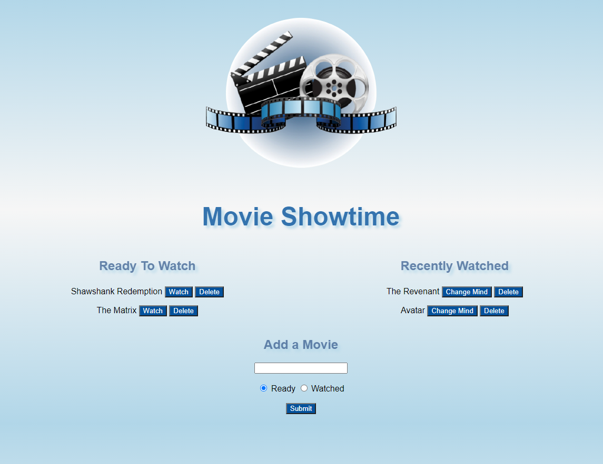

<h1 align="center"> Movie Showtime </h1>

## Table of Contents
- [Description](#description)
- [Installation](#install)
- [Usage](#usage)
- [Test](#test)
- [License](#license)
- [Questions](#questions)

## Description
Movie app with MySQL, Node, Express, Handlebars, and ORM.

## Installation
- npm install
- mysql -u root-p"your mysql password"
- source schema.sql
- source seeds.sql
- node server.js

## Deployed Site

## Screenshot

## License

## Questions
Github: https://github.com/esober101

Email: ericscottober@gmail.com
